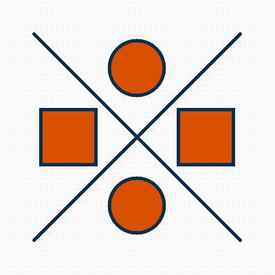

#Else and Else If Statements
Watch the video and follow along in the code widget below. __Stop__ at the ten-minute mark. The information that comes after ten minutes will be for another lesson.

<iframe src="https://www.youtube.com/embed/r2S7j54I68c?list=PLRqwX-V7Uu6Zy51Q-x9tMWIv9cueOFTFA?ecver=2" width="640" height="360" frameborder="0" style="position:absolute;width:100%;height:100%;left:0" allowfullscreen></iframe>

##Coding Challenge

Create a canvas with at least four shapes or lines whose color is dependent upon the position of `mouseX`. You must use an if statement, a couple else if statments, and an else statement. Use [Adobe Color](https://color.adobe.com) to help you use RGB values for your colors.

