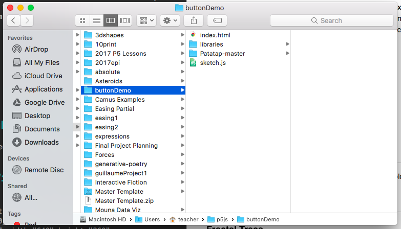
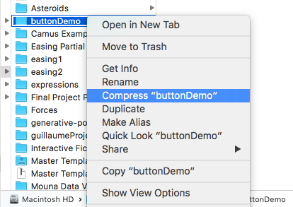
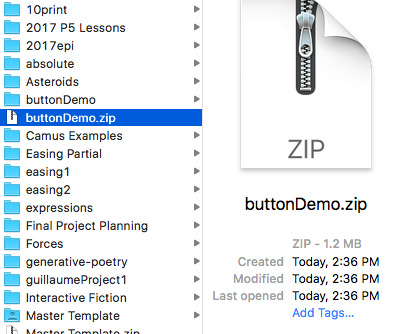
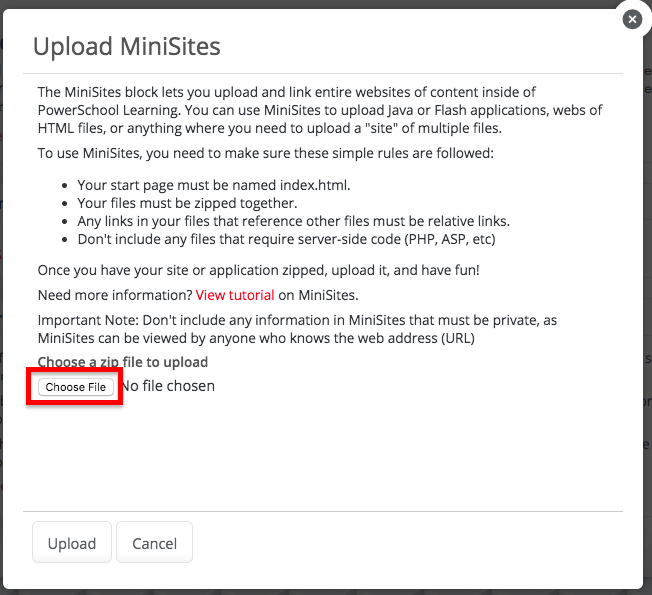
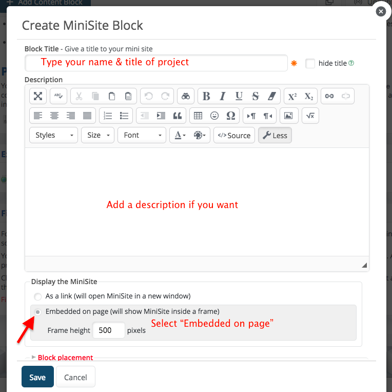

#Exploring P5
Now that you have learned some of the basics, it is time to explore the different kinds of things you can do in P5. Select two different videos, each from a different category, and follow along. Each project will be done with the editor of your choice (Atom, Brackets, etc.). You will embed your programs on a wikiproject.

* [Submit Your Work](#submit)
* [Art/Visual](#art)
* [Games](#games)
* [Text/Words](#text)
* [Sound](#sound)
* [Bots](#bots)
* [Video](#video)

##Submit Your Work

Before you hand in your work, you need to find the project folder for your program. For the purpose of this example, I will be using a project folder called `buttonDemo`.

Right-click (or Control + click on a Mac) to bring up the menu. Select `Compress` from the list. On Windows, select, `zip`.

You should now see a zipped folder in Finder or Windows Explorer.

Now, go to the class Haiku page and open the Wiki Project entitled `Exploring P5`. Add a content block, and select `MiniSites` as the type.

 

Click on the `Choose file` button and find the zipped folder on your computer. Click `Okay` and then upload the zipped folder to Haiku.

Enter your name and a title for your project. You can add a description if you want. Be sure you select the option to embed your project into the content block.

Save your work. It will take a few moments for your project to load. You can click the `Refresh` button to force your project to load. The canvas should appear and your project should start working. If you do not see all of your project, edit the content block and change the `Frame height` to match the height of your canvas in the `sketch.js` file.

[_Up_](#home)

##Art/Visual

###Fractal Trees

<iframe src="https://www.youtube.com/embed/0jjeOYMjmDU?list=PLRqwX-V7Uu6bxNsa_3SfCPyF9Md9XvXhR?ecver=2" width="640" height="360" frameborder="0" style="position:absolute;width:100%;height:100%;left:0" allowfullscreen></iframe>

[_Up_](#home)

###Mandelbrot Set (Fractal)

<iframe src="https://www.youtube.com/embed/6z7GQewK-Ks?list=PLRqwX-V7Uu6ZiZxtDDRCi6uhfTH4FilpH?ecver=2" width="640" height="360" frameborder="0" style="position:absolute;width:100%;height:100%;left:0" allowfullscreen></iframe>

[_Up_](#home)

###Phyllotaxis (Spiral)

<iframe src="https://www.youtube.com/embed/KWoJgHFYWxY?list=PLRqwX-V7Uu6ZiZxtDDRCi6uhfTH4FilpH?ecver=2" width="640" height="360" frameborder="0" style="position:absolute;width:100%;height:100%;left:0" allowfullscreen></iframe>

[_Up_](#home)

###Butterfly Generator

<iframe src="https://www.youtube.com/embed/O_0fRV4MTZo?list=PLRqwX-V7Uu6ZiZxtDDRCi6uhfTH4FilpH?ecver=2" width="640" height="360" frameborder="0" style="position:absolute;width:100%;height:100%;left:0" allowfullscreen></iframe>

[_Up_](#home)

###Countdown Timer

<iframe src="https://www.youtube.com/embed/MLtAMg9_Svw?list=PLRqwX-V7Uu6ZiZxtDDRCi6uhfTH4FilpH?ecver=2" width="640" height="360" frameborder="0" style="position:absolute;width:100%;height:100%;left:0" allowfullscreen></iframe>

[_Up_](#home)

##Games

__Note:__ Many of the game videos below rely on object-oriented programming (OOP). I suggest watching these videos on OOP ([1](https://www.youtube.com/watch?v=-e5h4IGKZRY&index=8&t=2s&list=PLRqwX-V7Uu6Zy51Q-x9tMWIv9cueOFTFA), [2](https://www.youtube.com/watch?v=QoFWCPVpWUE&index=20&list=PLRqwX-V7Uu6Zy51Q-x9tMWIv9cueOFTFA), [3](https://www.youtube.com/watch?v=pGkSHeEZLMU&index=23&t=499s&list=PLRqwX-V7Uu6Zy51Q-x9tMWIv9cueOFTFA), [4](https://www.youtube.com/watch?v=F3GeM_KrGjI&index=24&list=PLRqwX-V7Uu6Zy51Q-x9tMWIv9cueOFTFA), [5](https://www.youtube.com/watch?v=Yk18ZKvXBj4&index=26&t=1s&list=PLRqwX-V7Uu6Zy51Q-x9tMWIv9cueOFTFA)) before starting to create a game.

###Making a Side-Scroller

<iframe src="https://www.youtube.com/embed/Ouza_4SsbLc?list=PLRqwX-V7Uu6Z1JcqC1iG1oEsJrLX1IK5L?ecver=2" width="640" height="360" frameborder="0" style="position:absolute;width:100%;height:100%;left:0" allowfullscreen></iframe>

[_Up_](#home)

###Snake

<iframe src="https://www.youtube.com/embed/AaGK-fj-BAM?list=PLRqwX-V7Uu6aRpfixWba8ZF6tJnZy5Mfw?ecver=2" width="640" height="360" frameborder="0" style="position:absolute;width:100%;height:100%;left:0" allowfullscreen></iframe>

[_Up_](#home)

###Space Invaders

<iframe src="https://www.youtube.com/embed/biN3v3ef-Y0?list=PLRqwX-V7Uu6aRpfixWba8ZF6tJnZy5Mfw?ecver=2" width="640" height="360" frameborder="0" style="position:absolute;width:100%;height:100%;left:0" allowfullscreen></iframe>

[_Up_](#home)

###Flappy Bird

<iframe src="https://www.youtube.com/embed/cXgA1d_E-jY?list=PLRqwX-V7Uu6aRpfixWba8ZF6tJnZy5Mfw?ecver=2" width="640" height="360" frameborder="0" style="position:absolute;width:100%;height:100%;left:0" allowfullscreen></iframe>

[_Up_](#home)

###Agar.io

<iframe src="https://www.youtube.com/embed/JXuxYMGe4KI?list=PLRqwX-V7Uu6aRpfixWba8ZF6tJnZy5Mfw?ecver=2" width="640" height="360" frameborder="0" style="position:absolute;width:100%;height:100%;left:0" allowfullscreen></iframe>

[_Up_](#home)

###Minesweeper

<iframe src="https://www.youtube.com/embed/LFU5ZlrR21E?list=PLRqwX-V7Uu6aRpfixWba8ZF6tJnZy5Mfw?ecver=2" width="640" height="360" frameborder="0" style="position:absolute;width:100%;height:100%;left:0" allowfullscreen></iframe>

[_Up_](#home)

##Text/Words

###Text Input

<iframe src="https://www.youtube.com/embed/uNQSVU0IKec?list=PLRqwX-V7Uu6aoeLx_mWfz6XwtFaD9SkVX?ecver=2" width="640" height="360" frameborder="0" style="position:absolute;width:100%;height:100%;left:0" allowfullscreen></iframe>

[_Up_](#home)

###Text from File

<iframe src="https://www.youtube.com/embed/0Mq2CxspF5s?list=PLRqwX-V7Uu6aoeLx_mWfz6XwtFaD9SkVX?ecver=2" width="640" height="360" frameborder="0" style="position:absolute;width:100%;height:100%;left:0" allowfullscreen></iframe>

[_Up_](#home)

###Programming with Text

<iframe src="https://www.youtube.com/embed/DcoAjEZYies?list=PLRqwX-V7Uu6aoeLx_mWfz6XwtFaD9SkVX?ecver=2" width="640" height="360" frameborder="0" style="position:absolute;width:100%;height:100%;left:0" allowfullscreen></iframe>

[_Up_](#home)

###Intro to Regular Expressions

<iframe src="https://www.youtube.com/embed/7DG3kCDx53c?list=PLRqwX-V7Uu6YEypLuls7iidwHMdCM6o2w?ecver=2" width="640" height="360" frameborder="0" style="position:absolute;width:100%;height:100%;left:0" allowfullscreen></iframe>

[_Up_](#home)

###Madlib Generator

<iframe src="https://www.youtube.com/embed/ziBO-U2_t3k?list=PLRqwX-V7Uu6a343yZ_JcPzIric4SOGqMZ?ecver=2" width="640" height="360" frameborder="0" style="position:absolute;width:100%;height:100%;left:0" allowfullscreen></iframe>

[_Up_](#home)

##Sound

###Loading/Playing Sound
Watch this video as well as the "Play/Pause" video (it's just six minutes).

<iframe src="https://www.youtube.com/embed/Pn1g1wjxl_0?list=PLRqwX-V7Uu6aFcVjlDAkkGIixw70s7jpW?ecver=2" width="640" height="360" frameborder="0" style="position:absolute;width:100%;height:100%;left:0" allowfullscreen></iframe>

[_Up_](#home)

###Play/Pause Button
If you watched the "Loading/Playing Sound" video, watch this one as well.

<iframe src="https://www.youtube.com/embed/YcezEwOXun4?list=PLRqwX-V7Uu6aFcVjlDAkkGIixw70s7jpW?ecver=2" width="640" height="360" frameborder="0" style="position:absolute;width:100%;height:100%;left:0" allowfullscreen></iframe>

[_Up_](#home)

###Timing, Jumps, and Cues

<iframe src="https://www.youtube.com/embed/SfA5CghXw18?list=PLRqwX-V7Uu6aFcVjlDAkkGIixw70s7jpW?ecver=2" width="640" height="360" frameborder="0" style="position:absolute;width:100%;height:100%;left:0" allowfullscreen></iframe>

[_Up_](#home)

###Add Sound Effects

<iframe src="https://www.youtube.com/embed/40Me1-yAtTc?list=PLRqwX-V7Uu6aFcVjlDAkkGIixw70s7jpW?ecver=2" width="640" height="360" frameborder="0" style="position:absolute;width:100%;height:100%;left:0" allowfullscreen></iframe>

[_Up_](#home)

###Sound Visualization

<iframe src="https://www.youtube.com/embed/2O3nm0Nvbi4?list=PLRqwX-V7Uu6aFcVjlDAkkGIixw70s7jpW?ecver=2" width="640" height="360" frameborder="0" style="position:absolute;width:100%;height:100%;left:0" allowfullscreen></iframe>

[_Up_](#home)

##Bots

###Chatbot
<iframe width="560" height="315" src="https://www.youtube.com/embed/wf8w1BJb9Xc" frameborder="0" allowfullscreen></iframe>

[_Up_](#home)

###Text to Speech
<iframe width="560" height="315" src="https://www.youtube.com/embed/v0CHV33wDsI" frameborder="0" allowfullscreen></iframe>

[_Up_](#home)

###Speech Recognition
<iframe width="560" height="315" src="https://www.youtube.com/embed/q_bXBcmfTJM" frameborder="0" allowfullscreen></iframe>

[_Up_](#home)

###Voice Chatbot
<iframe width="560" height="315" src="https://www.youtube.com/embed/iFTgphKCP9U" frameborder="0" allowfullscreen></iframe>

[_Up_](#home)

##Video

###Brightness Mirror
<iframe width="560" height="315" src="https://www.youtube.com/embed/rNqaw8LT2ZU" frameborder="0" allowfullscreen></iframe>

[_Up_](#home)

###Checkbox Mirror
<iframe width="560" height="315" src="https://www.youtube.com/embed/m1G6WBvrOBE" frameborder="0" allowfullscreen></iframe>

[_Up_](#home)

###Painting with Pixels
<iframe width="560" height="315" src="https://www.youtube.com/embed/0V3uYA1hafk" frameborder="0" allowfullscreen></iframe>

[_Up_](#home)

###Video Effects
<iframe width="560" height="315" src="https://www.youtube.com/embed/jdKep6jo7b0" frameborder="0" allowfullscreen></iframe>

[_Up_](#home)

###"Instagram Filters"
Read the following [article](https://medium.com/@kellylougheed/instagram-filters-with-javascript-p5-js-83f28c9f7fda) to learn how to add filters to video captured by your webcam. Note: there is no video attached to this example.