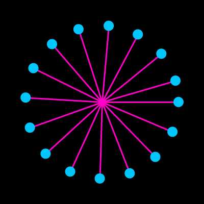

#Loops

Loops (and patterns) are an important part of programming. Watch the video below and follow along with the code widget.

<iframe src="https://www.youtube.com/embed/cnRD9o6odjk?ecver=2" width="640" height="360" frameborder="0" style="position:absolute;width:100%;height:100%;left:0" allowfullscreen></iframe>

##Coding Challenge

Using a for loop, create a repeating pattern. Use lines, shapes, and colors to make your pattern interesting.

