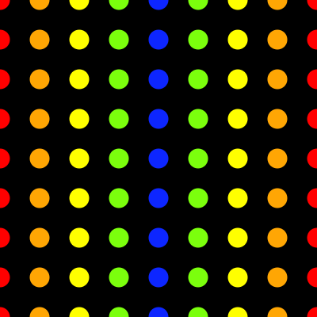

#Nested Loops

A single for loop can draw a row or a column of a shape. If you want a grid of shapes, you will need to use a nested loop. You will also get a quick introduction to the `random` command. Watch the video below and follow along with the code widget.

<iframe src="https://www.youtube.com/embed/1c1_TMdf8b8?ecver=2" width="640" height="360" frameborder="0" style="position:absolute;width:100%;height:100%;left:0" allowfullscreen></iframe>

##Coding Challenge

Create a grid pattern of circles as done in the video. Color the circles with the rainbow pattern in the image above.

