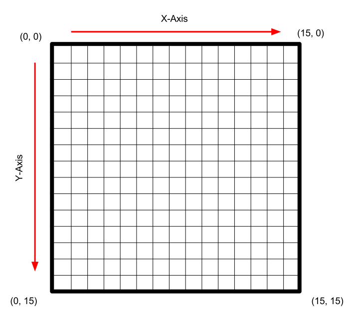

# 2017-18 EPI Guillaume

## Objective
Introduce students to the coordinate system and the basics of drawing with the P5 library in JavaScript. If time allows, perhaps students can animate their drawing as well.

## Materials
* [P5 Web Editor](https://alpha.editor.p5js.org/)
* [P5 cheat sheet](https://drive.google.com/file/d/1cb0w6CZhmbgz-JUvNpom4HIDbkTqXNGl/view?usp=copy)

## Coding Concepts

### P5 Web Editor
* Click on the link above to go to the P5 Web Editor
* If you do not have an account, click on `Sign Up` in the top-left corner
* Create an account using your school email and a password that you will not forget
* Neither M. Pignol nor I will remember them for you
* Rename your program with a meaningful title

### Your Program
* Our programs are going to use two functions, the `setup()` function and the `draw()` function.
* The `setup()` function runs only one time. Often, commands are put in this function because they only need to be called once. Examples of such commands are creating a space for our drawing, setting the color mode, setting the angle mode, removing exterior lines for all the shapes, etc.
* The next function our program needs is the draw function. This function is an infinite loop; it is always running if our program is running. Most of the code that you write will live in the `draw()` function.
* Only variable definitions should exist outside either of these functions. All other code should go in either the `setup()` or `draw()` functions.

### The Canvas
* Inside the `setup()` function you will see this line of code:

~~~
createCanvas(400, 400);
~~~

* The `canvas` is the area on which we will make our drawing.
* The two numbers represent the size of the canvas (all sizes are in pixels).
* The first number represents the width, and the second number represents the height.
* Go ahead a run your program by clicking on the button with the triangle.
* You don't see anything. That is because you did not give the `canvas` a color. So the default is white and rest of the page is white. Thus you can't see the canvas.
* To change the color of the `canvas` go into the `draw()` function and add this line of code:

~~~
background(0);
~~~

* Now run your program. You should see a black square that is 400 pixels wide and 400 pixels tall.

### The Coordinate System
* Before beginning to draw any shapes or lines, you need to understand how to place things on the `canvas`.
* The `canvas` uses a coordinate system. So any place on the canvas can be described with an `(x, y)` position.
* The `x` position describes the horizontal position, and the `y` position describes the vertical position.
* Unlike the coordinate systems you see in Math class, the `canvas` has the origin point in the top-left corner.

* So remember, as you move down the `canvas` the `y` value increases, and as you move up the canvas the `y` value decreases.

### Shapes
* Your shapes should come after the `background` command.
* Some basic shapes are `ellipse`, `rectangle`, and `triangle`.
* `ellipse` makes either a circle or an oval.
* Add the following line of code to your `draw()` loop:

~~~
ellipse(200, 200, 50, 50);
~~~

* Run your program. You should see a circle appear in the middle of the canvas. It is 50 pixels wide and 50 pixels tall.
* Start changing the first two numbers. What do you notice?
* Change the next two numbers. What do you notice?
* Now, change your code to look like this:

~~~
ellipse(200, 200, 50, 50);
rectangle(200, 200, 50, 50);
~~~

* Before running the program, can you guess what you would expect to happen?
* What actually happens?
* When you draw an `ellipse` the `(x, y)` coordinate is located at the center of the circle.
* When you draw a `rectangle` the `(x, y)` coordinate is located in the top-left corner of the square.
* When drawing an `ellipse` or a `rectangle`, you give the computer four numbers: the x-location, the y-location, the width, and the height.
* Drawing a `triangle` is completely different. You give the computer six numbers: the x-location of the first point, the y-location of the first point, the x-location of the second point, the y-location of the second point, the x-location of the third point, and the y-location of the third point.
* Change your code in the `draw()` function to this:

~~~
triangle(50, 50, 350, 50, 200, 350);
~~~

### Stroke Weight & No Stroke
* It is important to note that any modifier to a shape (color, stroke, etc.) should come __before__ the shape is drawn to the canvas. This will help you avoid odd behaviour in your program.
* As you noticed above, each shape you draw has line around the exterior, this is called the `stroke`.
* To remove this, use the command `noStroke();`. Remember, all shapes below this line of code will not have a `stroke`.
* To change the thickness of the `stroke`, use the `strokeWeight(5)` command. The larger the number you use, the thicker the line will be. The default `strokeWeight` is 1.

### Color
* Colors are described with either one, two, three, or four numbers.
* All numbers are between 0 and 255. Any numbers smaller than 0 will be treated as 0, and any numbers greater than 255 will be treated as 255.
* When you use only one number, the color will be grayscale, that is between black (0) and white (255).
* If you use two numbers then you will have a grayscale color with transparency.
* If you use three numbers, then you will have a "normal" color. The numbers represent red, green, and blue (in that order). These are the primary colors for computers. You mix them together to get any color.
* If you want to look up the RGB value for any color, use the [Adobe Color](http://color.adobe.com) website.
* If you use four numbers, then you get a "normal" color with transparency.

### Stroke
* The `stroke` command works just like the `color` command.
* You can use one, two, three, or four numbers.
* The numbers range from 0 to 255.
* `stroke` only applies to lines and the exterior lines of shapes.

### Lines
* To draw a line you need to provide the x and y-coordinates for two points.
* The order of these four numbers is the x-position of the first point, the y-position of first point, the x-position of the second point, and the y-position of second point.

### Custom Shapes
