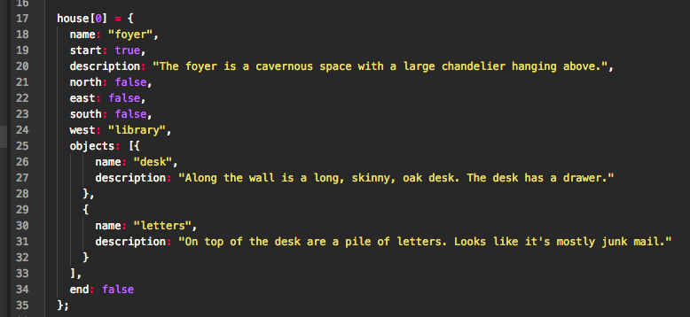

# Creating Your Rooms

## Structure
Each room in the house has a very specific structure. Mistakes in the stucture will cause the game to not work. Please be careful when coding your room.

* `house[0]` - This denotes the room number
* `name:` - This is where you write the name of the room
* `start:` - This states if this is the first room of the house; write `true` if the room is `house[0]`, write `false` for any other room
* `north:` - Write `true` if there is a room to the North, write `false` if there is no room
* `east:` - Write `true` if there is a room to the East, write `false` if there is no room
* `south:` - Write `true` if there is a room to the South, write `false` if there is no room
* `west:` - Write `true` if there is a room to the West, write `false` if there is no room
* `objects:` - This is a list of objects and their descriptions in a room
* `end:` - Write `true` if this is the last room in the house, write `false` if not

In the shared Google Document, find the page with your and your partner's names. Write the code for your room. Use good sentences for your descriptions, and don't forget the punctuation.
