# Making a Twitter Bot

## Twitter Account
If you do not already have a Twitter account, you will need to create one. Remember this will be an account for your mood project. You may want to find a name that reflects the nature of your work.

## Atom
If you have not yet already installed Atom, please [download and install](http://atom.io) it now.

## Node.js
You will also need to install [Node.js](http://nodejs.org) as well. Use the `Current` version of Node.

## Command line
We will be using the command line, so you will need to familiarize yourself with it.

### Command Line Basics
**Mac Users** - Launch the `Terminal` app.

**Windows Users** - Launch the `Cmd` program.

Here are some of the basic commands we will be using:

|Action| Mac | Windows|
|:----:|:----:|:----:|
|List Files and Folders| ls | dir|
|Change Directory| cd "path" | cd "path"|
|Go to Parent Directory| cd ..| cd..|
|Make a Folder| mkdir "folder name"|mkdir "folder name"|
|Start Node Program| node "program name"| node "program name"|
|Use Node Package Manager| npm "command" | npm "command"|

### Preparing Your Bot
* Create a project folder for the Twitter bot
  * Create the folder in a place easy to access (like the Desktop)
* Open your command line, change to the directory for the bot
  * Use the `cd` command to go to the Twitter bot folder
* Use `npm init` to initialize our project
  * You can use the system defaults for these questions
  * Be sure to pay attention to the `entry point` question; this will be the file used to launch your bot
    * For example, `bot.js` would work as the `entry point` 
* Add dependencies to your project
  * `npm install twit --save`
  * `twit` is the Node module that lets us talk to Twitter
  * `npm install johnny-five --save`
  * `johnny-five` is the Node module that lets us talk to the Arduino

## Twitter Bot

### Working with Node
* Open Atom, click `File`, and then click on `Open Project Folder`
* Find the folder for your Twitter bot; do not open the folder
* Click one time on the Twitter bot folder, then click `Open` (Mac) or `Select Folder` (PC)
* You should see a `package.json` file in the folder for your project
* Click `File`, then click `New`
* Save this new file and give it the same name as your entry point from the `npm init` (`bot.js`)
* You are now ready to start writing your bot

Node is very different from P5.js in that P5 is for making something that runs on the web, while Node is for making a program that runs on its own. Start off by adding the following line of code:

~~~javascript
console.log("Hello");
~~~

Now, go to your command line. Make sure you are in your Twitter bot folder.
Type the following command:

~~~
node bot.js
~~~

Be sure to use the file name for your Twitter bot (which is the same as the entry point). You should see `Hello` appear on the command line.

The `console.log` command writes text to the command line. We are going to use this often to test our code. Let's replace `"Hello"` with the message `"The bot is starting."`. This will let us know that the bot is working.

### Coding the Bot
Let's change the `Hello` message to `The bot is starting`. We also need to be able to use the `twit` module, so add this line of code:

~~~javascript
console.log("The bot is starting.");

//Twitter variables
let Twit = require('twit');
~~~

To make a bot, we need to connect our code to a Twitter account. You will need to create an object that has your sensitive information. You should not share these codes with anybody.

~~~javascript
let T = new Twit({
  consumer_key: 'Your consumer key goes here',
  consumer_secret: 'Your consumer secret goes here',
  access_token: 'Your access token goes here',
  access_token_secret: 'Your access token secret goes here'
});
~~~

To find these secrets, keys, and tokens, go to the [Twitter Apps](https://apps.twitter.com/) website and log in. Click on the `Create New app` button. Give your Twitter bot a name, a description, and website. Twitter says you can put a placeholder for the website. Check the developer agreement and create your application.

Click on the `Keys and Access Tokens` tab.

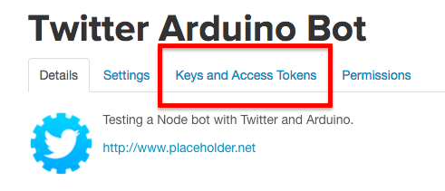

Copy and paste the consumer information into the appropriate place in your code.

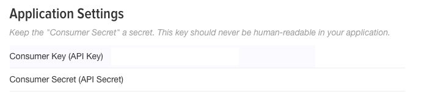

Scroll down a bit and copy and paste the access token information.

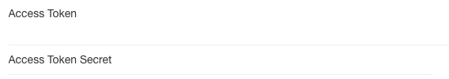

Now that our program can connect to our Twitter account. Now add the following code:

~~~javascript
//Twitter Code
let stream = T.stream('user');

stream.on('tweet', tweetEvent);
~~~

The first line of code means we are creating a stream for tweets sent to our bot. The second line of code turns the stream on. We are now listening for tweets sent to the bot.

The `tweetEvent` code is a function that will be called every time a tweet is sent to the bot. This type of function is called a callback. We now need to define `tweetEvent`.

~~~javascript
function tweetEvent(eventMsg) {
  console.log('Tweet Event!');
}
~~~

This should write to the command line `Tweet Event!` every time somebody tweets at your bot. Go ahead and start your bot:

~~~
node bot.js
~~~

Have your friend tweet your bot. You should see the text appear on your screen for every tweet at your bot.

Now we are going to add some information to the output. Add the following lines of code to your `tweetEvent` function:

~~~javascript
function tweetEvent(eventMsg) {
  console.log('Tweet Event!');

  let replyto = eventMsg.in_reply_to_screen_name;
  let text = eventMsg.text;
  let from = eventMsg.user.screen_name;

  console.log(replyto + ' ' + from);
}
~~~

You just created three variables that hold information from tweets at your bot. `replyto` contains the name of the bot receiving the tweet (this should be your bot's name). `text` is the message sent to your bot. `from` is the name of the person who sent you this tweet. That last console log will write to the command line your bot's name and the name of the person sending the tweet.

Stop your bot by going to the command line and pressing `Ctrl + C`. Restart your bot and have your neighbor send you a tweet. You should see the new information on the command line.

### Getting our Bot to Respond

Now we want our bot to respond to tweets sent its way. First, verify that the tweet was indeed a reply to your bot:

~~~javascript
if (replyto === 'FaisBot') {

}
~~~

Next, compose a message to send:

~~~javascript
if (replyto === 'FaisBot') {
  let newtweet = '@' + from + ' thank you for tweeting me.'
}
~~~

The message is going to be an at-reply (hence the `@`) with a thank you message. Now tweet this new message you just made by calling the function `tweetIt`.

~~~javascript
if (replyto === 'FaisBot') {
  let newtweet = '@' + from + ' thank you for tweeting me.'
  tweetIt(newtweet);
}
~~~

The function `tweetIt` does not exist, so let's define it:

~~~javascript
function tweetIt(txt) {
  let tweet = {
    status: txt
  }

  T.post('statuses/update', tweet);
}
~~~

The first thing we are doing is converting the message from a string to JSON. Twitter requires JSON for it to work. Next we are tweeting the message.

Save your code, stop the bot, and restart it with the updated code. Now every time somebody tweets your bot, the bot will send a thank you message. Go ahead and test this with your neighbor. Look at your Twitter account to make sure that this is working.

Great, our Twitter bot is working. Before we can continue, we need to set up our Arduino to work with Twitter.

## Setup the Arduino
You will need an Arduino, a single LED, and a USB cable to connect the Arduino to your computer.

First, plug the LED into the Arduino. Put the long pin in number 13, and put the short pin in `GND`. When done, it should look something like this.

Now plug the Arduino into your computer. You will need to [download](https://www.arduino.cc/en/Main/Software) and install the Arduino IDE. Once installed, open the Arduino IDE.

Make sure that the Arduino is properly connected to the computer. At the very top of the screen, click on `Tools`. Then click on `Port`. Make sure that you are not connected by bluetooth. It should say something like `usbmodem`.

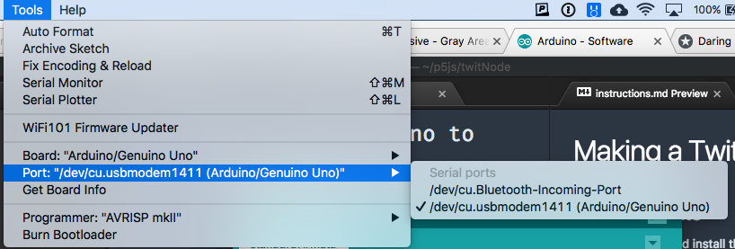

Now we need to load the `Simple Firmata` program onto the Arduino. Click on `File`, `Examples`, `Firmata` and then select `Standard Firmata`.

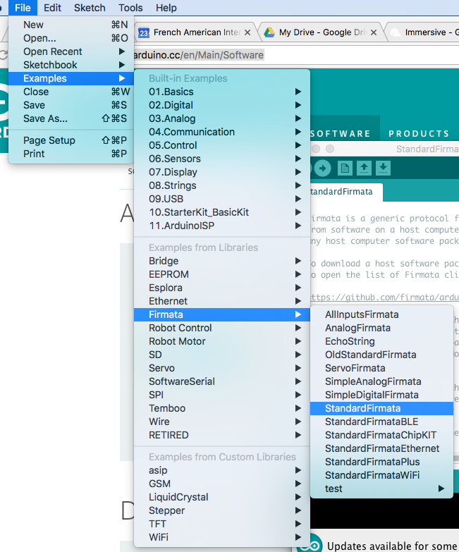

Finally, upload the Simple Firmata to the board by clicking on the upload icon on the Arduino IDE.

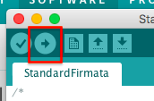

You can close the Arduino IDE. We won't need it again for this project.

## Interact with Arduino
The first thing we are going to do is turn on/off a single LED. Once we do this, we will move on to multicolored LEDs.

### Single LED
Go back to our bot code in Atom. Up near the variables used for our Twitter bot, we are going to declare variables for the Arduino.

~~~javascript
//Arduino Variables
let five = require('johnny-five');
let board = new five.Board();
let led;
let toggleState = false;
~~~

The first variable is to use the `johnny-five` Node module. The second variable represents our Arduino board. The third variable represents our LED. The final variable determines if the LED is on or off.

Below the Arduino variables, we are going to start our Arduino code. First, let's get the Arduino ready:

~~~javascript
//Arduino Code
board.on("ready", readyMsg);
~~~

When the board is ready, it will call the function `readyMsg` which is another callback. Next, we need to define `readyMsg`.

~~~javascript
function readyMsg() {
  console.log("Board ready!");
}
~~~

When the board is ready, it will write a message to the command line.

Now we need to define a function to turn the LED on:

~~~javascript
function ledOn() {
  led = new five.Led(13);
  led.on();
}
~~~

The first line of code defines the LED as being connected to pin 13 on the Arduino. The next command turns the LED on.

Finally, we need a function to turn the LED off:

~~~javascript
function ledOff() {
  led = new five.Led(13);
  led.off();
}
~~~

Like the `ledOn` function, the first line of code says the LED is connected to pin 13. The second line turns the LED off.

We are now going to return the to the `tweetEvent` function to use `ledOn` and `ledOff`. Our Twitter bot is going to use hashtags to control the LED. A tweet to our bot with `#on` will turn the LED on, and a tweet to our bot with `#off` will turn the LED off.

Let's start by making a variable that will store a list of all of the hashtags in the tweet. We will do this after the call to the `tweetIt` function.

~~~javascript
if (replyto === 'FaisBot') {
  let newtweet = '@' + from + ' thank you for tweeting me.'
  tweetIt(newtweet);

  let hasHashTag = eventMsg.entities.hashtags;
}
~~~

If the tweet does not have a hashtag, then `hasHashTag` will contain the value `null` (that means the list is empty). Let's test to see if the value is something other than `null`. If this is true, then let's write a message to the command line. If there is no hashtag, then write a message to the command line.

~~~javascript
if (hasHashTag) {
  console.log("There is a hashtag");
} else {
  console.log("No hashtag");
}
~~~

From the list of hashtags, we are going to select the the first one and store it in the variable `hashTag`.

~~~javascript
if (hasHashTag) {
  console.log("There is a hashtag");
  let hashTag = eventMsg.entities.hashtags[0].text;
} else {
  console.log("No hashtag");
}
~~~

Now let's test to see if the hashtag is `#on`. If this is true, write a message to the command line and call the `ledOn` function.

~~~javascript
if (hasHashTag) {
  console.log("There is a hashtag");
  let hashTag = eventMsg.entities.hashtags[0].text;

  if (hashTag === 'on') {
    console.log('Turn LED on');
    ledOn();
  }
} else {
  console.log("No hashtag");
}
~~~

If the first hashtag is not `#on` then test to see if it is `#off`. If this is true write a message to the command line and call the `ledOff` function.

~~~javascript
if (hasHashTag) {
  console.log("There is a hashtag");
  let hashTag = eventMsg.entities.hashtags[0].text;

  if (hashTag === 'on' || hashTag === 'On') {
    console.log('Turn LED on');
    ledOn();
  } else if (hashTag === 'off' || hashTag === 'Off') {
    console.log('Turn LED off');
    ledOff();
  }
} else {
  console.log("No hashtag");
}
~~~

This should make your bot control the single LED attached to your Arduino. Make sure that everything is connected properly. Save your work, and restart your bot. Have your neighbor test out your bot with the `#on` and `#off` hashtags.

### Wiring the Multicolored LEDs
Before continuing, we need to wirte up two LEds to a breadboard, and then connect the breadboard to the Arduino.

**Hardware**
You will need the following items:

* 1 Arduino board
* 1 mini breadboard
* 1 USB cable
* 2 multicolor LEDs
* 6 resistors
* 8 jumper calbes

**Attaching the LEDs**

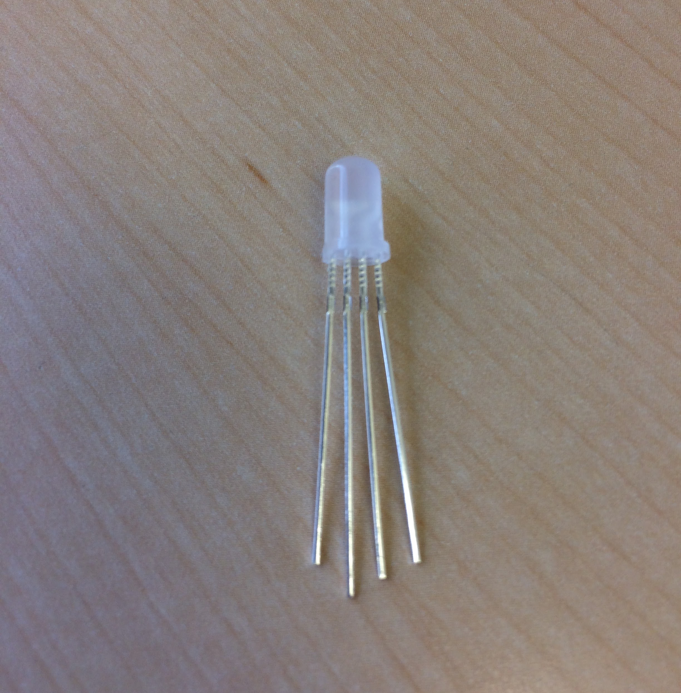

The LED (light emitting diode, or light) has four pins. The longest pin is the ground. The single short pin by itself (the pin on the far left in the above picture) is the red pin. This pin controls how much red light the LED produces. The short pin directly on the other side of the ground pin is the green pin. The short pin furthest away from the ground pin is the blue pin. The only way you can tell which pin is which color is by their relationship to the ground pin. Pay attention as to how you attach the LED to the breadboard. This guide assumes that the red pin in on the far left.

Plug in both LEDs (facing the same direction) toward the top of the breadboard.

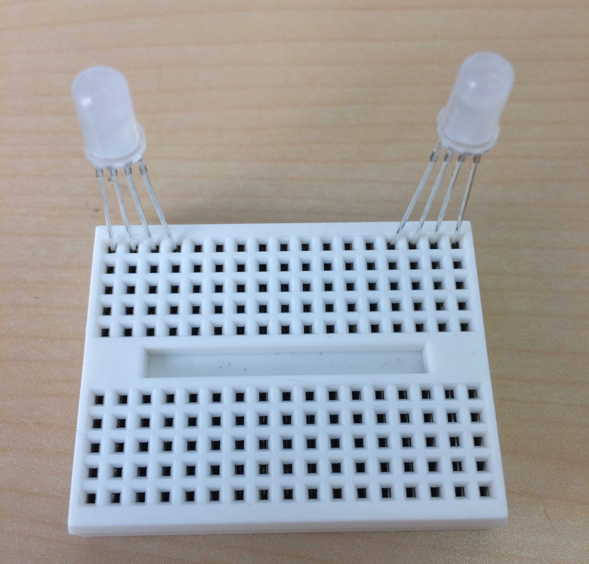

**Adding the Resistors**
The unscientific description of a resistor is that it "sucks up" excess electricty. The Arduino board puts out more electricity than the LEDs can accept. You need to attach a resistor to each of the color pins.

Because the resistors are quite long, I cut the wires so that the resistors sit much closer to the breadboard.

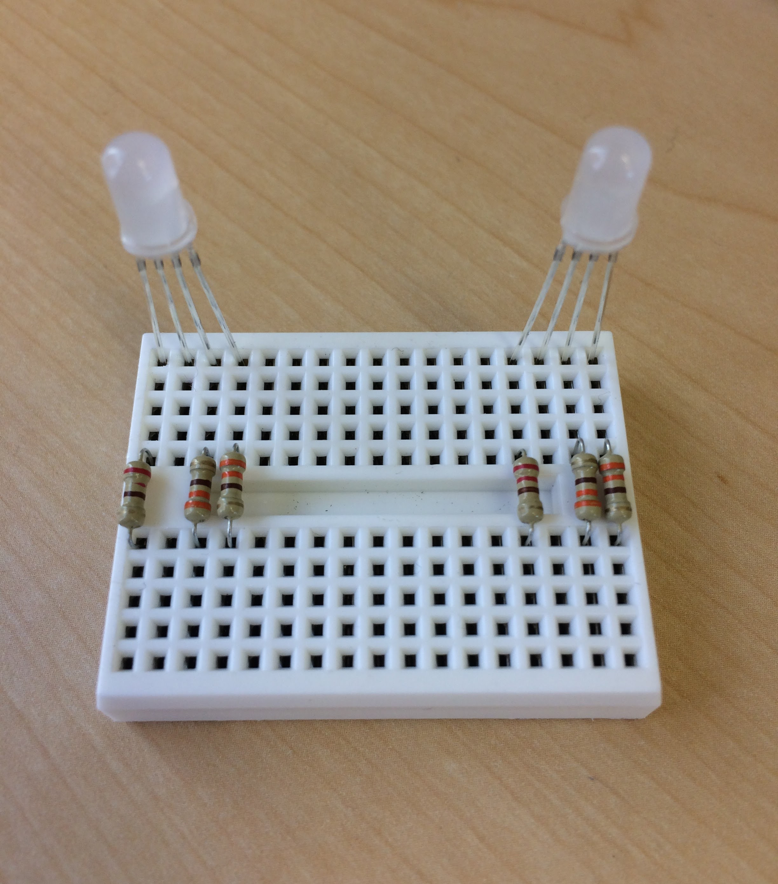

Here are two important things to remember when attaching your resistors:

* I attached the LEDs with the single short pin on the left. You do not use a resistor with the ground pin, which is why I skip a pin. If you installed your LEDs in the opposite direction, make sure that your resistors are properly placed.
* Notice the gap in the middle of the breadboard. Electricty cannot "jump" the gap. The resistors are used to "bridge" the gap. Make sure your resistors go across the gap in the breadboard.

**Attaching Wires to the Arduino**

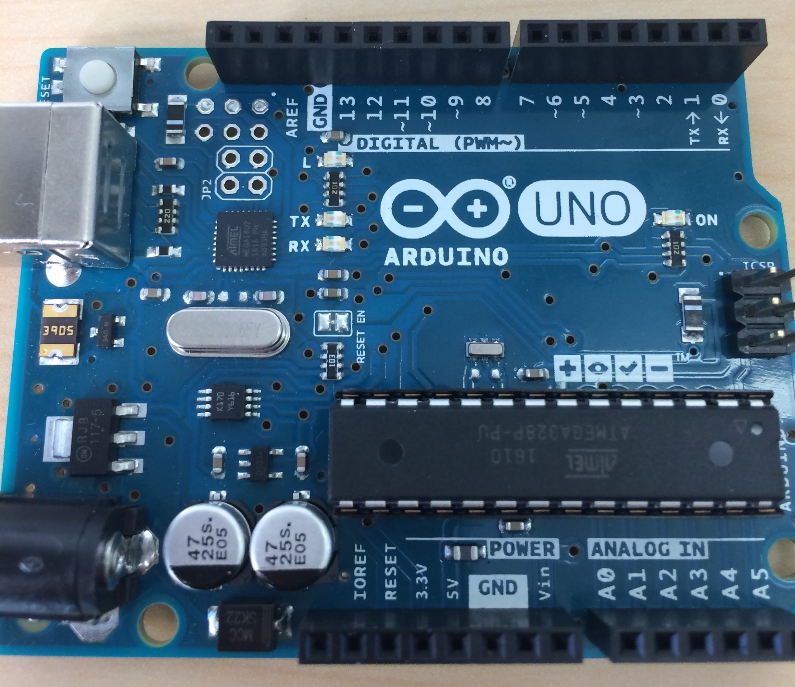

Look carefully at the picture above. The LEDs __must__ be attached to the pins with a `~` in front of the number. There are only six numbers like this: `~11`, `~10`, `~9`, `~6`, `~5`, and `~3`.

Attach one of your LEDs to pins `~11`, `~10`, and `~9`. The other LED will be attached to pins `~6`, `~5`, and `~3`.

Plug cables into the breadboard pins that are associated with a resistor. Then plug those cables into the pins with a `~` on the Arduino. It does not matter which color of cable you use. I try to avoid using same colored cables next to one another; this makes wires a little bit more difficult. You should see something like this:

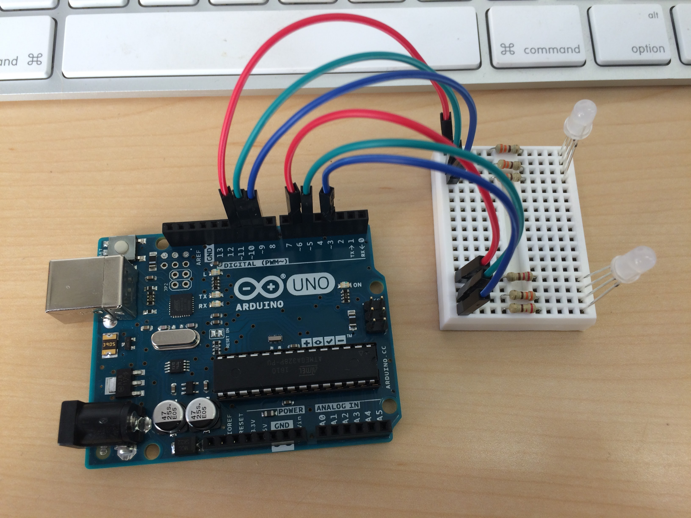

**Attaching the Ground Wire**

To complete the circuit, each LED has to be grounded. However, there is only one pin on the Arduino board for the LED ground wire. You are going to get around this limitation by "chaining" the two ground pins together. Connect the first LED to the second LED with a cable plugged in the ground pins (no resistors) on the "top half" of the breadboard. Then connect the second LED to the ground pin with a second cable just below the first ground cable. Lastly, connect the second ground wire to the `5V` pin on the Arduino board. You should see something like this:

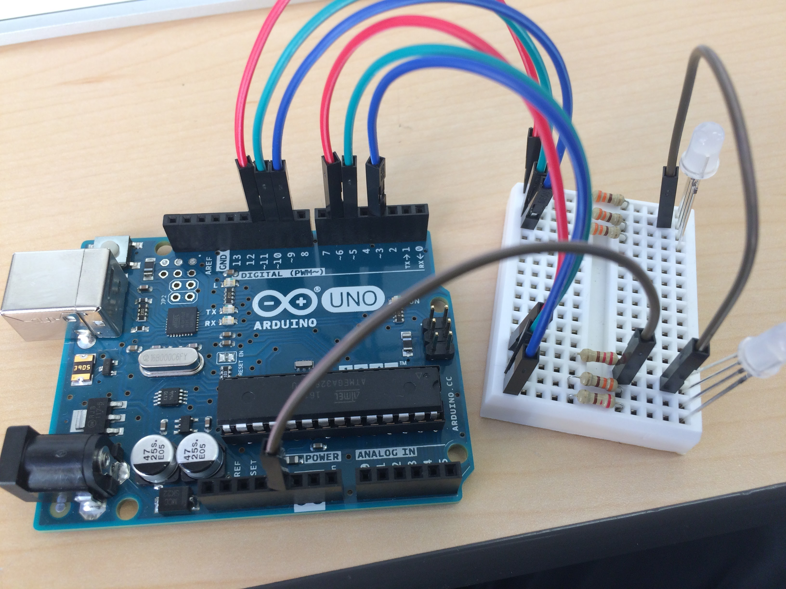 

### Coding the Multicolored LEDs
Colors for the LEDs are done in either hexadecimal or with CSS color names. To use the hexadecimal, go to [Adobe Color](http://color.adobe.com) as usual. Underneath the `RGB` numbers you will see `HEX`. Be sure to add a `#` before the hexadecimal number. For example, the color red would be `#FF0000`. You can also type the CSS color name (with a capital letter) instead. Here are some basic CSS colors (Note: some of these colors are hard to distinguish when in light form):

|Color Name|Color Name|Color Name|
|:--------:|:--------:|:--------:|
|Maroon    |Purple    |Navy      |
|Red       |Fuschia   |Black     |
|Orange    |Lime      |Gray      |
|Yellow    |Teal      |Silver    |
|Olive     |Aqua      |White     |
|Green     |Blue      |          |

The first thing we need is a general function that changes the color of the LEDs. We tell this function our mood, and then the proper color is selected.

~~~javascript
function changeMood(mood) {

}
~~~

Notice that the word `mood` is used. This is a parameter. This means the `changeMood` function requires some piece of information for the function to work. We will refer to this information as `mood`; it is placeholder for the actual mood we tweet to the bot. Next we need to create our LED variables.

~~~javascript
function changeMood(mood) {
  let light1 = new five.Led.RGB({
    pins: {
      red: 6,
      green: 5,
      blue: 3
    },
    isAnode: true
  });

  let light2 = new five.Led.RGB({
    pins: {
      red: 11,
      green: 10,
      blue: 9
    },
    isAnode: true
  });
  
}
~~~

Be sure to verify that the the numbers next to `red`, `green`, and `blue` match correct pin on your Arduino. Next we need to determine what our mood is. We'll start adding a mood for `okay`. This means that the LEDs will have the color black (be turned off). Be sure to turn the LED on, then change its color. Remember, colors are done with a hexadecimal (don't forget the `#`) or a CSS (don't forget the capital letter) color.

~~~javascript
function changeMood(mood) {
  let light1 = new five.Led.RGB({
    pins: {
      red: 6,
      green: 5,
      blue: 3
    },
    isAnode: true
  });

  let light2 = new five.Led.RGB({
    pins: {
      red: 11,
      green: 10,
      blue: 9
    },
    isAnode: true
  });

  if (mood === "okay") {
    light1.on();
    light1.color("Black");
    light2.on();
    light2.color("Black");
  }
}
~~~

Now we are going to add another mood to our code by using an `else if` statement.

~~~javascript
function changeMood(mood) {
  let light1 = new five.Led.RGB({
    pins: {
      red: 6,
      green: 5,
      blue: 3
    },
    isAnode: true
  });

  let light2 = new five.Led.RGB({
    pins: {
      red: 11,
      green: 10,
      blue: 9
    },
    isAnode: true
  });

  if (mood === "okay") {
    light1.on();
    light1.color("Black");
    light2.on();
    light2.color("Black");
  } else if (mood === "annoyed") {
    light1.on();
    light1.color("Olive");
    light2.on();
    light2.color("Olive");
  }
}
~~~

Add another three moods to your code. Choose colors that are easily differentiated from a glance. We cannot, however, test our code because we have not yet called the `changeMood` function. Go down to the `tweetEvent` function. We are not going to test if the hashtag says `on` or `off`. Instead we are going to test for the moods. Our first test is going to be for the mood `okay`.

~~~javascript
if (hashTag === 'okay') {
	console.log('I am okay');
	changeMood("okay");
} 
~~~

We are going to write a message to the command line with the mood. Next we are going to call the `changeMood` function. Remember, this function requires a piece of information to work properly. This is where we use the actual mood. In this case, the mood is `okay`. Don't forget to use quotes. Next, we are going to test for another one of our moods with an `else if` statement.

~~~javascript
if (hashTag === 'okay') {
	console.log('I am okay');
	changeMood("okay");
} else if (hashTag === 'annoyed') {
	console.log('I am annoyed');
	changeMood("annoyed");
}
~~~

Continue to add `else if` statements for the remainder of your moods. We are going to add one last bit of code in case we are sent a mood that we do recognize (could be a typo, or it could be a different mood altogether).

~~~javascript
if (hashTag === 'okay') {
	console.log('I am okay');
	changeMood("okay");
} else if (hashTag === 'annoyed') {
	console.log('I am annoyed');
	changeMood("annoyed");
} else {
	console.log("Don't recognize the mood: " + hashTag);
}
~~~

Notice, we are not just going to write an error message, we want to see the hashtag that was sent to our bot. This is a useful way to track the errors. Perhaps people send `#ok` instead of `#okay`. In this case we could alter our code such that either hashtag will turn the LEDs off.

Okay, your bot should be ready to test. Save your code and restart your bot. Have your neighbor test your bot. Use all the hashtags, and make sure that the colors are easily distinguished. Also, send an incorrect hashtag to see how our bot handles bad input.